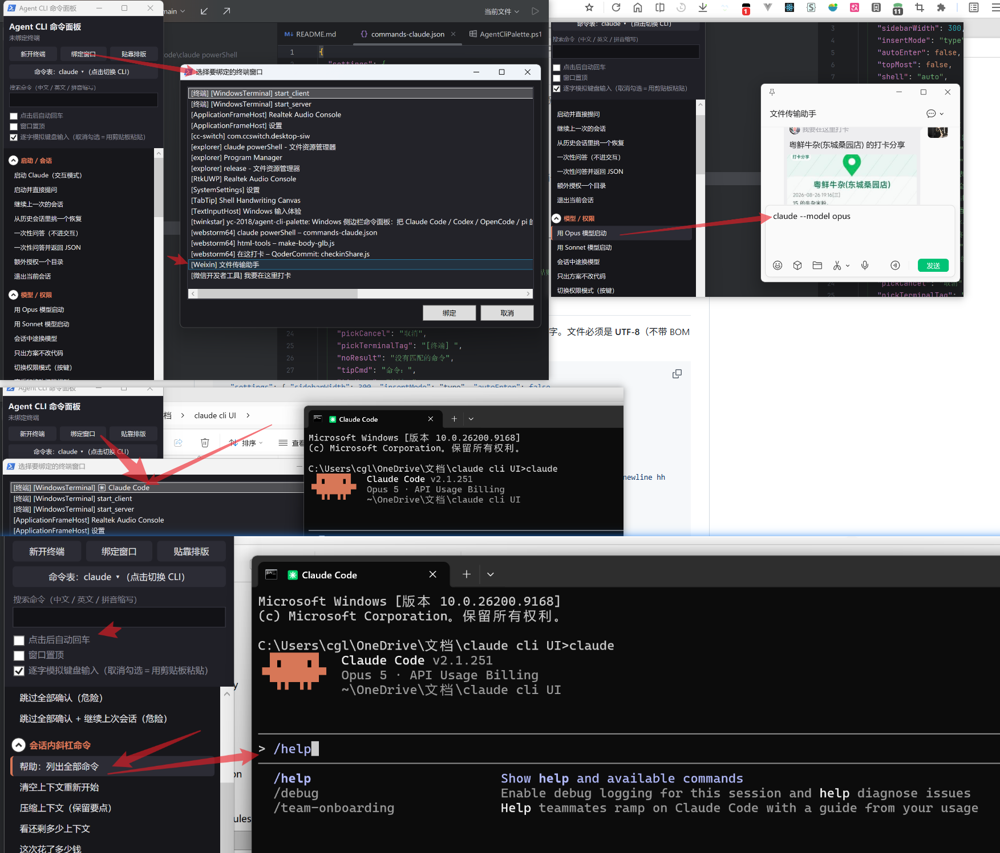
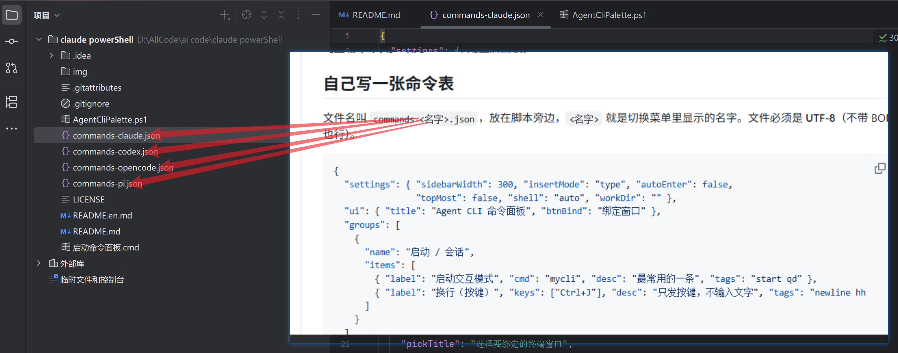

# Agent CLI 命令面板

[English](README.en.md) · **中文**

一个贴在屏幕边上的 Windows 侧边栏，把 AI 编程 CLI 的命令列成中文按钮。点一下，真实命令就被敲进你绑定的那个终端窗口里。

面板本身不认识任何一条命令——它只做两件事：把条目里的文本输入到目标终端，或者向它发送一组按键。所以换一张 `commands-*.json` 就能换一个 CLI，不用改一行代码。



内置六张命令表，开箱可用：

| 命令表 | 面向的 CLI | 分组 | 条目 |
|---|---|---|---|
| `commands-claude.json` | Claude Code | 9 | 161 |
| `commands-cmd.json` | Windows cmd.exe | 8 | 149 |
| `commands-codex.json` | OpenAI Codex CLI | 8 | 61 |
| `commands-opencode.json` | OpenCode | 7 | 83 |
| `commands-pi.json` | pi | 8 | 97 |
| `commands-powershell.json` | Windows PowerShell | 8 | 116 |



## 为什么会有这个东西

这些 CLI 的能力都藏在几十个参数和斜杠命令里。`--dangerously-skip-permissions`、`-a untrusted`、`--sandbox workspace-write`、`/compact`、`/rewind`——记得住的人不多，`--help` 又长得看不完。

所以每个按钮都带一句中文解释，真实命令只在鼠标悬停时才显示。你按“我想干什么”找，而不是按“这个参数叫什么”找。搜索框支持中文、英文和拼音首字母（输入 `ys` 能搜到“压缩上下文”）。

## 快速开始

1. 把这个仓库克隆或下载到本地。
2. 双击 `启动命令面板.cmd`。
3. 点【新开终端】开一个终端，或者点【绑定窗口】选一个已经开着的。
4. 点任意一条命令。

需要 Windows 10/11 和自带的 Windows PowerShell 5.1，不需要装任何东西。

## 面板怎么用

**先绑定一个终端。** 面板需要知道该往哪里输入。【新开终端】会起一个新的并自动绑定；【绑定窗口】会列出当前所有可见窗口，终端类的进程会被标上 `[终端]` 前缀排在前面。

**左键 = 输入到终端，右键 = 复制到剪贴板。** 右键这条在目标终端是管理员权限时特别有用（见下面的已知限制）。

**三个复选框：**

- *点击后自动回车* —— 输入完直接执行。默认关闭，方便你先补参数再回车。
- *窗口置顶* —— 面板不会被其他窗口盖住。
- *逐字模拟键盘输入* —— 默认开启，用 `SendInput` 一个字符一个字符地敲。取消勾选则改用剪贴板粘贴，长命令更快，但会覆盖你的剪贴板内容。

**【贴靠排版】** 把面板贴到工作区左边，并把绑定的终端摆到右边剩下的空间里。

**【命令表：xxx ▾】** 点开切换 CLI。切换只换命令表和界面文字，**绑定的终端不动**——同一个窗口，换一套命令。菜单每次点开都重新扫描目录，所以面板开着的时候丢一个新的 `commands-*.json` 进来，立刻就能看到。

**【重载命令表】** 改完 JSON 不用重启面板。

## 自己写一张命令表

文件名叫 `commands-<名字>.json`，放在脚本旁边，`<名字>` 就是切换菜单里显示的名字。文件必须是 **UTF-8**（不带 BOM 也行）。

```json
{
  "settings": { "sidebarWidth": 300, "insertMode": "type", "autoEnter": false,
                "topMost": false, "shell": "auto", "workDir": "" },
  "ui": { "title": "Agent CLI 命令面板", "btnBind": "绑定窗口" },
  "groups": [
    {
      "name": "启动 / 会话",
      "items": [
        { "label": "启动交互模式", "cmd": "mycli", "desc": "最常用的一条", "tags": "start qd" },
        { "label": "换行（按键）", "keys": ["Ctrl+J"], "desc": "只发按键，不输入文字", "tags": "newline hh" }
      ]
    }
  ]
}
```

每个条目：

- `label` —— 按钮上显示的字，写人话。
- `cmd` —— 真实命令，只在悬停提示里出现。想让光标停在引号中间就写 `mycli ""`。
- `keys` —— 和 `cmd` 二选一，发送按键而不是文字，例如 `["Ctrl+Shift+F"]`、`["Escape", "Escape"]`。支持 `Ctrl` / `Shift` / `Alt` / `Win` 组合，以及 `Enter`、`Tab`、`Esc`、`F1`-`F12`、方向键等名字。
- `desc` —— 一句解释，悬停时显示。
- `tags` —— 额外的搜索关键词，惯例是同时放英文和拼音首字母。

`ui` 块里没写的键会沿用当前正在用的那套文字，所以一张新表只给 `title` 加命令也能跑，缺的不会变成空按钮。

`settings.shell` 决定【新开终端】开的是什么：`auto` 优先 `pwsh.exe`、没有就退回 `powershell.exe`，也可以直接写一个可执行文件名——`commands-cmd.json` 就把它设成了 `cmd.exe`，这样点开的终端正好是这张表里的命令所针对的那个 shell。

## 命令行参数

```powershell
# 指定用哪张命令表启动
powershell -NoProfile -STA -File AgentCliPalette.ps1 -Config "commands-pi.json"

# 建完整个界面并跑内部检查，不显示窗口
powershell -NoProfile -STA -File AgentCliPalette.ps1 -SelfTest

# 自检时再真开一个终端，把命令端到端跑通一次
powershell -NoProfile -STA -File AgentCliPalette.ps1 -SelfTest -Live

# 保留 powershell.exe 自己的控制台窗口（排错用）
powershell -NoProfile -STA -File AgentCliPalette.ps1 -KeepConsole
```

`-SelfTest` 会报告发现了哪些命令表、渲染了多少按钮、按键组合解析成什么虚拟键码、切换命令表能否干净地来回，以及提示框的贴边翻转位置。改完东西先跑这个。

## 命令表里的内容是怎么来的

不是凭记忆写的。每一条都对着装在本机上的那个版本核过：先读 CLI 自己的 `--help`，斜杠命令和快捷键则直接从安装好的可执行文件/bundle 里把注册表 grep 出来。

这么做是因为一开始吃过亏：面板里曾经写着 Claude Code 的换行是 Shift+Enter，而它实际的提示语是 `ctrl+j for newline`——Shift+Enter 得先跑一次 `/terminal-setup` 写入按键绑定，而且有些终端根本不支持。

同样的原因，有些东西被**故意留空**：

- Claude Code 的快捷键取自 `claude.exe` 里内置的默认键位表（`context:"Global"` / `"Chat"` 那一段），所以 `Ctrl+O` 写成「展开完整记录」而不是网上常说的「切换 verbose」，`Ctrl+R` 是搜索输入历史。贴图键取 **Windows 分支**：二进制里是 `windows||wsl ? "alt+v" : "ctrl+v"`，所以这台机器上是 Alt+V。另外 `Ctrl+_`（撤销输入）、`Ctrl+]`（打开 artifact）**没有写进去**——这些键名在面板的虚拟键码表里会解析成别的键（`-` 会变成 Insert、`]` 会变成 Menu），发出去是错的，宁可不列。已经从 Claude Code 移除的 `/agents` 和 `/review` 也换掉了，前者改为直接编辑 `.claude/agents/`，后者改为 `/security-review` 和 `/ultrareview`。
- Codex 的 `/approvals`、`/limits`、`/undo` 等在二进制里查不到，就没写进去。
- OpenCode **没有快捷键分组**：它 TUI 的按键默认值在二进制里 grep 不到（能查到的那批属于 Web/桌面界面，不是终端），所以宁可不写。
- pi 的快捷键取的是 **Windows 分支**。它的按键表里有 `windowsKeybindings ? "alt+v" : "ctrl+v"` 这样的判断，所以这台机器上贴图是 Alt+V、排队后续消息是 Ctrl+Q、上一个模型是 Alt+P，和其他平台不一样。
- cmd 表的参数是逐条对着本机 `<命令> /?` 核的，`cmd /c help` 的内置命令清单也核过。两个例外：`sfc` 和 `DISM` 连显示帮助本身都要管理员权限（`DISM` 直接返回 `Error: 740`），所以这两条的子命令拼写没能在本机验证，条目说明里写明了需要管理员终端。
- cmd 表里**没有** `mode con:` 改窗口大小和 `color` 改配色：这两条在 conhost 里有效，在 Windows Terminal 里会被忽略，给不出一个到处都对的说明。`wmic` 也没写——它已被微软标为弃用，新版本里随时可能消失。
- PowerShell 和 cmd **是两套东西**，所以单独一张表。cmd 里 `dir /b`、`set VAR=value`、`%PATH%`、`| find /c /v ""` 那套写法，在 PowerShell 里要么报错要么语义不同——PowerShell 的管道传的是对象不是文本，对应的是 `Get-ChildItem`、`$env:PATH`、`Where-Object`、`Measure-Object` 这一套。这张表以本机自带的 **Windows PowerShell 5.1** 为底线核过（cmdlet 存在性、别名映射、行数统计写法都实测过），凡是 PowerShell 7 才有的语法（`??`、三元、`&&` 管道链、`ForEach-Object -Parallel`）都没用，5.1 上照样能跑。`settings.shell` 设为 `auto`：有 `pwsh.exe`（7+）就用它，没有就退回自带的 `powershell.exe`。很多条目的说明里点明了 `dir`/`ls`/`cat`/`cp` 这些从 cmd、Unix 过来的别名，方便过渡。

## 已知限制

- **管理员权限的终端收不到按键。** 普通权限的进程无法向高权限窗口发送输入，这是 Windows 的 UIPI 隔离，绕不过去。面板会明确报错而不是把命令误输入到自己身上。这种情况用右键复制，或者用【新开终端】开一个同权限的终端。
- **只支持 Windows。** 整个实现建立在 WPF 和 user32 的 `SendInput` / `AttachThreadInput` 上。
- **面板窗口一次只绑一个终端。**
- 如果装了 QQ 拼音，控制台可能会冒出 `libpng warning: iCCP: cHRM chunk does not match sRGB`。那是输入法的 DLL 注入所有 GUI 进程之后打出来的，和本项目无关。

## 实现上的几个硬约束

改代码前值得知道，这几处不是随手写成这样的：

- **`AgentCliPalette.ps1` 只能是纯 ASCII。** Windows PowerShell 5.1 读不带 BOM 的 `.ps1` 时用系统 ANSI 代码页解码，中文会直接变成乱码。所有面向用户的文字都住在 JSON 里，由脚本显式按 UTF-8 读进来。
- **`.cmd` 必须是 CRLF。** LF 换行的批处理文件 `cmd.exe` 会解析错。仓库里用 `.gitattributes` 钉住了。
- **启动器故意不用 `-ExecutionPolicy Bypass` + `-WindowStyle Hidden`。** 这对组合是杀毒软件识别 PowerShell 加载器的经典特征，本机的杀软会直接删掉这样的 `.cmd`。所以它老老实实先显示控制台，等面板窗口起来之后再由脚本自己隐藏——启动失败时报错还留在屏幕上，能看见。
- **不要给事件处理器用 `.GetNewClosure()`。** 闭包会被托管在它自己的动态模块里，里面对 `$script:` 的赋值传不回外层脚本作用域。绑定窗口的功能就曾经因为这个静悄悄地失灵。

## 友情链接

- [linux.do](https://linux.do)